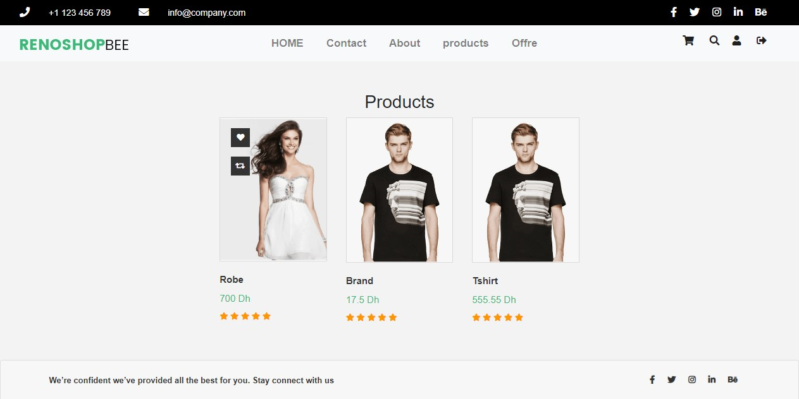
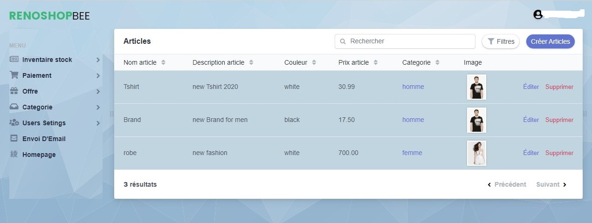

## Description

ecomerce shop for managing products and users and categories

---

#### Technologies

- PHP symfony (easy admin, Mailer,...)
- Bootstrap4 (WooCommerce template)
- Mysql
- javascript

---

#### Features

- Crud User
- Set Roles For User (Admin,Normal User,..)
- Login System
- Dash Bord
- Crud Categories
- Crud Product
- Offrer Section
- Cart
- Validation
- Send Email Using Mailer Package (Require conf !)

---

#### Installation

1. Set the DATABASE_URL (database , user,pass ) in .env by default it uses mysql
2. Create the database  
   ` php bin/console doctrine:database:create`  
3. Create the schema  
   `php bin/console doctrine:schema:update --force`
4. Change the e MAILER_DSN in the config for using mailer (requires a valide email to use see the [docs](https://symfony.com/doc/current/mailer.html#installation) )
5. Create A user white the role of admin in the database and encrypt the pass using
    `bin/console security:encode-password 'your_plain_password' `
6. Run   `composer install`
7. Start symfony server

---

### Tools

- Vscode
- xampp
